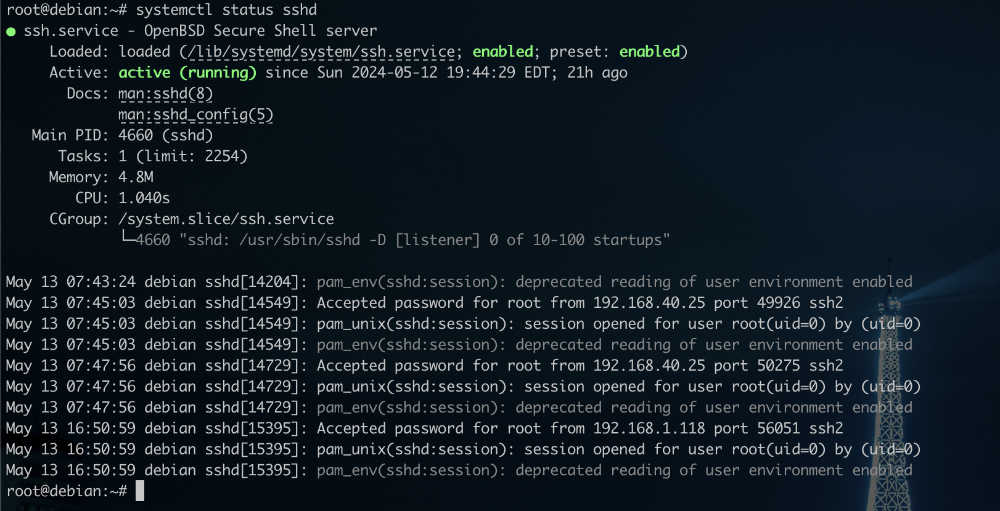
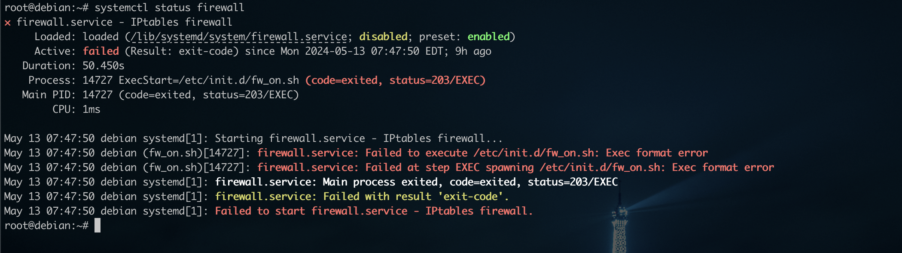
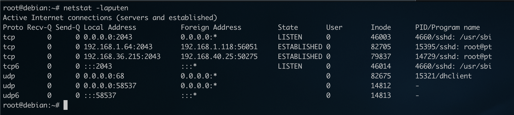
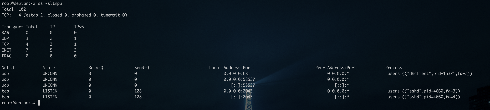

# RASPBERRY PI USER GUIDE


## SSH

Secure Shell est un protocol réseau permettant d'accéder à un appareil à distance (si celui-ci a le protocol d'installé et le serveur en écoute). Il est principalement utilisé afin d'effectuer différentes tâches d'administration depuis une console. Il écoute sur le port 22 (Par défaut) mais ce port peut être changé dans son fichier de configuration dans "/etc/ssh/sshd_config" (Port 22).

### Sécurisation

Afin d'en empêcher les accès non autorisés, certains paramètres doivent être modifiés, voici une liste non exhaustive:

```
Port 22 -> Port XXXX # Le port sur lequel le service va écouter
PermitRootLogin no / without-password # Autoriser ou pas l'accès ssh via le compte super admin (à éviter)
PubkeyAuthentication yes # Autoriser l'accès en ssh via l'utilisation d'une paire de clé
PasswordAuthentication no # Ne pas autoriser l'accès en ssh via le mot de passe
AllowUsers <allowed user> # Autoriser l'accès à un certain utilisateur 
AllowGroups <allowed groups> # Autoriser l'accès à un certain groupe
MaxAuthTries 3 # Autoriser maximum 3 tentatives en échec, au delà, il sera bloqué
MaxSessions 2 # Autoriser maximum 2 connexions simultanées 
```

Pour permettre l'accès via une clé, il va falloir générer sur l'appareil utilisé pour se connecter, la paire de clé (chiffrement asymétrique utilisant généralement le chiffrement RSA) :

**Ce chiffrement va faire le lien entre une clé publique et privé pour vérifier l'hôte qui tente de se connecter, la clé publique se trouve sur le serveur et le client utilisera la clé privé pour se connecter.**

## Génération d'une clé

Pour génrérer une clé, il faut utiliser la commande suivante :

```
ssh-keygen -t rsa -b 4096
```

-t : Permet de spécifier l'algorithme de chiffrement à utiliser pour la clé, ici RSA (l'algorithme à ce jour le plus sûr)
-b : La taille en Mo que la paire de clé va avoir. Evidemment plus celle-ci est grande plus elle sera difficile à casser mais peux aussi prendre plus de temps à générer.

Dans un premier temps, il demande à quel endroit stocker le fichier et le nom de celui-ci. Par défaut une clé est généré sous le nom id_rsa à la racine du répertoire courant de l'utilisateur dans le dossier .ssh.

```
Generating public/private rsa key pair.
Enter file in which to save the key (/Users/loulax/.ssh/id_rsa): raspberry-key
```

Ensuite, si l'on veut mettre une "passphrase" pour l'accès à cette clé, c'est fortement recommandé principalement dans le cas où elle se trouve sur un ordinateur portable et que l'on est amené à se déplacer régulièrement avec:

```
Enter passphrase (empty for no passphrase):
Enter same passphrase again:
```

**Si l'on veut pas de passphrase, faire ENTRER 2x pour passer cette étape, puis la clé sera générée** 

```
Your identification has been saved in raspberry-key
Your public key has been saved in raspberry-key.pub
The key fingerprint is:
SHA256:5zmA8VOTEbBSXS3mEeza9l0VtfQuk0h9WTCeOWIa+y0 loulax@undefined-pc
The key's randomart image is:
+---[RSA 4096]----+
|        ooo+oooo+|
|       . ..o=oo==|
|      o . =++o*o+|
|       = . Boo =.|
|      . S +o. + o|
|         =.oo. o.|
|          +.E....|
|           . .. .|
|                 |
+----[SHA256]-----+
```

On peux la retrouver dans le répertoire courant où nous nous trouvions lorsque la clé a était généré:

```
➜  ~ ls -l raspberry-key
-rw-------@ 1 loulax  staff  3454 May 13 12:21 raspberry-key
```

Une fois généré, il va falloir l'envoyer sur le serveur 

```
ssh-copy-id -i raspberry-key -p XXXX -l <user>@<ip du terminal distant> 

/usr/bin/ssh-copy-id: INFO: Source of key(s) to be installed: "raspberry-key.pub"
/usr/bin/ssh-copy-id: INFO: attempting to log in with the new key(s), to filter out any that are already installed
/usr/bin/ssh-copy-id: INFO: 1 key(s) remain to be installed -- if you are prompted now it is to install the new keys
root@172.20.10.2's password:

Number of key(s) added:        1

Now try logging into the machine, with:   "ssh 'root@172.20.10.2'"
and check to make sure that only the key(s) you wanted were added.
```

### Accès en ssh via la clé

```
ssh -i raspberry-key -p XXXX -l <user>@<ip du terminal distant>

Enter passphrase for key 'raspberry-key':


Linux vm1 6.1.0-21-arm64 #1 SMP Debian 6.1.90-1 (2024-05-03) aarch64

The programs included with the Debian GNU/Linux system are free software;
the exact distribution terms for each program are described in the
individual files in /usr/share/doc/*/copyright.

Debian GNU/Linux comes with ABSOLUTELY NO WARRANTY, to the extent
permitted by applicable law.
Last login: Mon May 13 06:10:23 2024 from 172.20.10.3
root@vm1:~#
```

Me voilà connecter à mon équipement via la clé privé.

> [!NOTE]
>
> Dans cet exemple je n'ai pas changé le port ssh en écoute donc pas besoin de spécifier quand c'est celui par défaut


## Debug service

Un service sous linux peut-être amené à "crash" pour différentes raisons. Voici les premiers diagnostiques à faire pour vérifier l'origine de la panne:

- Utiliser systemd status pour vérifier l'état sur service et voir différentes erreurs. systemd est le démon qui gère les différents services sous linux (pour la majorité des distributions).

  - Pour vérifier l'état d'un service, utiliser la commande systemctl status <service>

  - pour démarrer un service systemctl start <service>
  - pour stopper un service systemctl stop <service>
  - pour activer un service au démarrage systemctl enable <service>

  

  Dans cet exemple avec le service ssh, on peux voir qu'il est chargé et actif (qu'il démarre automatiquement au démarrage du serveur).

  Aucune erreur apparente dans l'exemple ci-dessus, par contre dans le cas suivant, j'ai créé un service firewall qui gère mes règles de pare-feu dans un fichier bash (shell script):

  

  On peux constater que le service est loaded mais active: failed. Et en regardant en dessous, on voit l'erreur qui empêche au service de se charger d'où l'intérêt de regarder en 1er lieu avec systemd. On voit exec format error, autrement dit une erreur dans le format du fichier /etc/init.d/fw_on.sh, si j'inspecte avec la commande cat ou head, je peux voir l'erreur (bien sûr faite exprès pour l'exemple) :

  ```
  z#!/bin/bash # Le shebang
  
  iptables="/usr/sbin/iptables"
  
  #CLEAR IPTABLES RULES
  $iptables -F
  $iptables -X
  $iptables -t nat -F
  $iptables -t nat -X
  ```

  Le shebang est utilisé pour les fichiers de code sous linux lorsque l'extension d'un fichier n'est pas spécifié, il faut lui indiquer le langage utilisé dans le script pour pouvoir ensuite l'interpréter correctement. Dans ce cas, c'est du bash d'où /bin/bash (le fichier binaire du programme/langage).

  Je dois donc supprimer le z au début de la ligne car il ne doit rien y avoir ni même un espace avant le #, une fois la modification terminée, je redémarre le fichier :

  ```
  systemctl restart firewall
  ```

  > [!TIP]
  >
  > Pour la modification d'un fichier, j'utilise l'éditeur nano. Un éditeur de texte en ligne de commande simple mais très efficace pour de l'édition rapide.
  >
  > Pour l'utiliser il suffit de taper nano suivi du fichier à créer ou modifier puis une fois l'édition terminé sauvegarder et fermer avec CTRL + X

  

- journalctl permet d'avoir accès à plus de message pour débogue
  journalctl permet de visualiser les journaux systèmes plus facilement sans devoir aller fouiller manuellement dans le répertoire /var/log/. Pour voir le journal d'un service:

  ```
  journalctl -xeu <service>
  ```

  Dans l'exemple avec le pare-feu:

  ```
  journalctl -xeu firewall.service
  ```

  Ce qui donne beaucoup d'informations mais la plus utile est celle-ci "Failed to execute..." :

  

  Dans cet exemple les journaux système ne donnent pas plus d'infos que systemd mais il peut parfois fournir plus d'informations.

- (Si c'est un service réseau), vérifier les ports en écoute sur la machine
  Il existe plusieurs commandes pour ça mais les principales sont <u>**netstat**</u> et <u>**ss**</u>.
  Par exemple pour voir s le ssh est bien en écoute sur la machine...
  Avec netstat :

  

  On peux voir sur la 1ère ligne déjà que le port 2043 écoute sur toutes les ip "0.0.0.0" et au bout de la ligne on voit le programme /usr/bin/sshd

  Avec ss :

  

  Dans ce cas on peux voir également le port 2043 en écoute sur toutes les ip via l'utilisateur sshd. Au dessus on peux voir l'utilisateur dhclient qui écoute sur le port 68 pour recevoir des trames DHCP.

  

