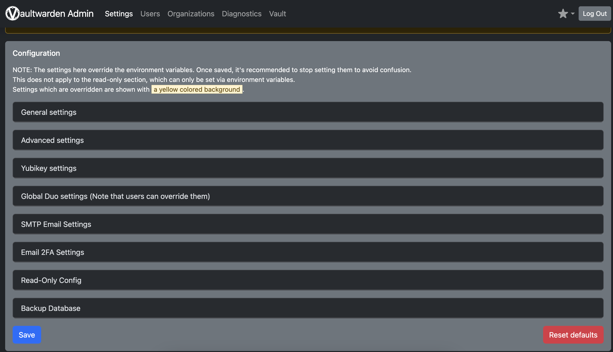
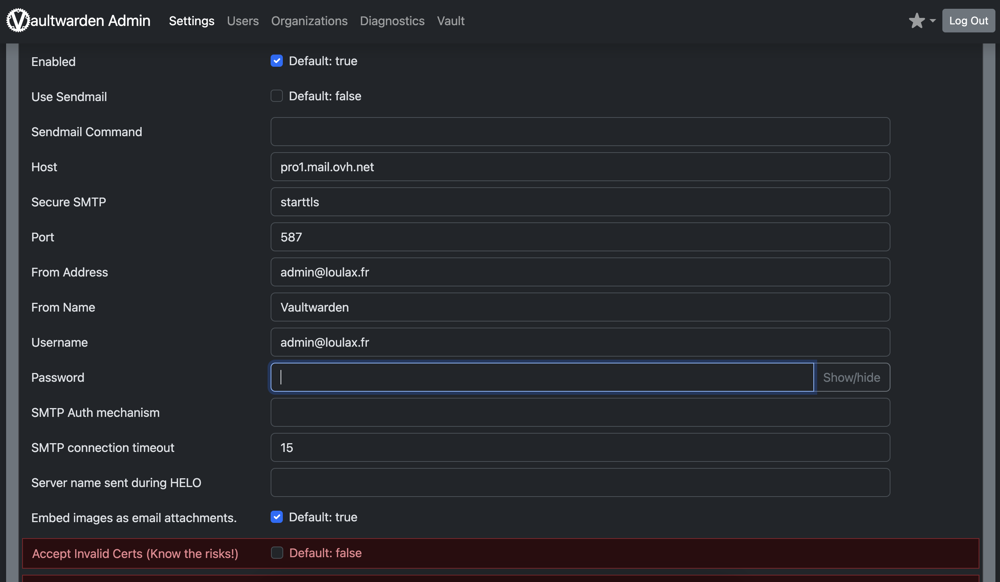

# VAULTWARDEN


### Pré-requis:

Avoir un serveur linux avec les performances minimales suivantes:

- RAM min : 2Gb
- CPU : Dual core 1ghz
- 32Gb de stockage
- Connexion internet 100mb/s

## Installation docker

Docker est un système de containerisation qui permet d'avoir des machines isolés depuis son hôte, le princiipe est pratiquement similaire à la virtualisation seulement il consomme beaucoup moins de ressources matériel et se déploie bcp plus rapidement puisque c'est qu'une image d'un système. C'est d'ailleurs un fork de LXC qui est natif à linux

```bash
sudo install -m 0755 -d /etc/apt/keyrings
curl -fsSL https://download.docker.com/linux/debian/gpg | sudo gpg --dearmor -o /etc/apt/keyrings/docker.gpg
sudo chmod a+r /etc/apt/keyrings/docker.gpg
echo \
  "deb [arch="$(dpkg --print-architecture)" signed-by=/etc/apt/keyrings/docker.gpg] https://download.docker.com/linux/debian \
  "$(. /etc/os-release && echo "$VERSION_CODENAME")" stable" | \
  sudo tee /etc/apt/sources.list.d/docker.list > /dev/null
```

Il faut ensuite mettre à jour la liste des paquets pour prendre en compte les modifications effectuées sur les repos locaux puis installer docker

```bash
apt-get update
apt-get install docker-ce docker-ce-cli containerd.io docker-buildx-plugin docker-compose docker-compose-plugin
```

Pour vérifier que docker est bien setup, faire la commande suivante:

```bash
docker run hello-world
```

## Installation de Vaultwarden

Il faut "pull" l'image depuis les dépots de docker hub

```bash
docker pull vaultwarden/server:latest
```

On va générer un token pour l'accès admin

```bash
openssl rand -base64 58

#Ca génère une suite comme ceci
zSm8Fqz0JuOAaUffIpyqpd8aG8wAg0mY+ktVN1j1i1NeOQwoUxVSqXQwqjZRuY0b/4Xv501t0fCLF5gwOgouRfU+kEg=
```

On va créer un point de montage local pour le montage du container

```bash
cd /root/
mkdir vaultwarden && chmod -R 777 vaultwarden
```

Maintenant on lancer le container comme ceci:

```bash
docker -d -e ADMIN_TOKEN=<generated token> --name <container name> -v <local path>:/data/ -p 8080:80 vaultwarden/server:latest
```


## Installation NGINX

Je vais installer maintenant nginx en tant que reverse-proxi pour permettre de pointer le sous-domaine de mon container et rediriger le traffic vers celui-ci.

```nginx
apt-get install -y nginx
cd /etc/nginx/sites-enabled
nano mydomain.conf


server {
    listen 443 ssl http2 ;
    server_name sub.mydomain.tld;

    http2_push_preload on;

    ssl_certificate <chemin vers le certification fullchain.cert>;
    ssl_certificate_key <chemin vers la clé privé du certificat>;

    add_header Strict-Transport-Security "max-age=31536000";

    location / {
        proxy_set_header X-Forwarded-Host $host:$server_port;
        proxy_set_header X-Forwarded-Server $host;
        proxy_set_header X-Forwarded-For $proxy_add_x_forwarded_for;
        proxy_pass_request_headers on;
        proxy_pass http://localhost:8080;
    }
}
```

Le coffre vaultwarden inclut une page d'administration accessible à l'adresse https://mydomain.tld/admin, cet espace permet de paramétrer pleins de choses, notamment gérer les utilisateurs etc ce qui est par conséquent une zone très sensible. Nous allons rajouter la section suivante dans vaultwarden avec de ne pas permettre à n'importe qui d'y accéder.

```nginx
   location /admin {

	allow <réseau autorisé>;
	deny all;

	proxy_set_header "Connection" "";

    proxy_set_header Host $host;
    proxy_set_header X-Real-IP $remote_addr;
    proxy_set_header X-Forwarded-For $proxy_add_x_forwarded_for;
    proxy_set_header X-Forwarded-Proto $scheme;
    proxy_pass http://localhost:8080/admin;
}
```
Cette section contrôle toutes les ip qui accèdes à /admiin et si ça ne match pas avec la directive allow <réseau autorisé>; une erreur 403 sera retourné. 
Alors soit on autorise depuis sont réseau local ou depuis un vpn voir les 2 selon le cas de chacun.

## Iptables

maintenant il faut mettre les règles iptables adéquates pour faire fonctionner le container, sachant que docker en créé initialement (se référer à ma doc iptables pour la gestion d'un service et gérer les règles iptables) :

```bash
#Création des règles de pare-feu
vim /etc/init.d/fw_up.sh

#CREATEION DES CHAINES DOCKER
/usr/sbin/iptables -N DOCKER
/usr/sbin/iptables -N DOCKER-ISOLATION-STAGE-1
/usr/sbin/iptables -N DOCKER-ISOLATION-STAGE-2
/usr/sbin/iptables -N DOCKER-USER
/usr/sbin/iptables -t nat -N DOCKER

#LOCAL TRAFFIC
/usr/sbin/iptables -A INPUT -i lo -j ACCEPT
/usr/sbin/iptables -A OUTPUT -o lo -j ACCEPT

#Autoriser le traffic web
/usr/sbin/iptables -A INPUT -p tcp -m multiport --dports 80,443 -m conntrack --ctstate NEW,ESTABLISHED -j ACCEPT
/usr/sbin/iptables -A OUTPUT -p tcp -m multiport --sports 80,443 -m conntrack --ctstate ESTABLISHED -j ACCEPT

#DOCKER
/usr/sbin/iptables -A FORWARD -j DOCKER-USER
/usr/sbin/iptables -A FORWARD -j DOCKER-ISOLATION-STAGE-1
/usr/sbin/iptables -A FORWARD -o docker0 -m conntrack --ctstate RELATED,ESTABLISHED -j ACCEPT
/usr/sbin/iptables -A FORWARD -o docker0 -j DOCKER
/usr/sbin/iptables -A FORWARD -i docker0 ! -o docker0 -j ACCEPT
/usr/sbin/iptables -A FORWARD -i docker0 -o docker0 -j ACCEPT
/usr/sbin/iptables -A DOCKER -d 172.17.0.2/32 ! -i docker0 -o docker0 -p tcp -m tcp --dport 80 -j ACCEPT
/usr/sbin/iptables -A DOCKER-ISOLATION-STAGE-1 -i docker0 ! -o docker0 -j DOCKER-ISOLATION-STAGE-2
/usr/sbin/iptables -A DOCKER-ISOLATION-STAGE-1 -j RETURN
/usr/sbin/iptables -A DOCKER-ISOLATION-STAGE-2 -o docker0 -j DROP
/usr/sbin/iptables -A DOCKER-ISOLATION-STAGE-2 -j RETURN
/usr/sbin/iptables -A DOCKER-USER -j RETURN
/usr/sbin/iptables -t nat -A PREROUTING -m addrtype --dst-type LOCAL -j DOCKER
/usr/sbin/iptables -t nat -A OUTPUT ! -d 127.0.0.0/8 -m addrtype --dst-type LOCAL -j DOCKER
/usr/sbin/iptables -t nat -A POSTROUTING -s 172.17.0.0/16 ! -o docker0 -j MASQUERADE
/usr/sbin/iptables -t nat -A POSTROUTING -s 172.17.0.2/32 -d 172.17.0.2/32 -p tcp -m tcp --dport 80 -j MASQUERADE
/usr/sbin/iptables -t nat -A DOCKER -i docker0 -j RETURN
/usr/sbin/iptables -t nat -A DOCKER ! -i docker0 -p tcp -m tcp --dport 9090 -j DNAT --to-destination 172.17.0.2:80

```

Maintenant rendez-vous à l'adresse web configuré dans nginx pour accéder au container vaultwarden https://sub.mydomain.tld/admin



Puis dans la section SMTP, renseigner les paramètres suivants selon votre fournisseur



Et enfin validez en bas à gauche.

Il sera probablement nécessaire de redémarrer le container, pour ce faire:

```bash
docker stop <container name>
docker start <container name>
#pour y accéder
docker exec -it <container name> /bin/bash
```

## Backup ses données

Toutes les données tel qu'identifiants et comptes sur le serveur bitwarden se trouvent sur le container dans /data/db.sqlite3 à l'exception des fichiers et send uploadé dessus. Ces derniers se trouvent dans un dossier propre à eux.

Une tache cron est programmé sur le container docker qui sauvegardera le fichier db.sqlite3 depuis le dossier "Data" dans le container vers le dossier local (celui sur l'hote)

Pour transférer manuellement le fichier db.sqlite3 depuis le container vers l'hote utiliser la commande suivante :

```
docker cp <container name>:/data/db.sqlite3 /chemin-destination
```

Puis si nécessaire utiliser SSH ou FTP afin de mettre le fichier en lieu sûr en cas de panne du serveur hote.

## Restoration de ses données

Si dans un cas on a besoin de migrer son container sur un autre serveur, revenir à l'étape de déploiement du container puis restaurer le fichier sql comme ceci:

```
docker cp db.sqlite3 <container name>:/data/
```

Attention, il va falloir stop le container et le relancer pour pouvoir prendre en compte le dernier fichier et ainsi récupérer les données importer.

## Mettre à jour de vaultwarden

Vu que c'est un outil open-source qui est maintenant, il reçoit régulièrement des mises à jour. C'est pourquoi il est important de le maintenant à sa dernière version stable pour d'abord éviter les bugs si il y en a et également pour la sécurité de son coffre, si une faille de sécurité est découverte. L'idée est de vérifier si il existe une version supérieur est dans ce cas récupérer la dernière image depuis le dépot git puis mettre à jour ensuite les containers.

J'ai écrit un script bash qui permet d'automatiser tout ça dont voici le contenu :

```bash
#!/bin/bash

# black='\e[0;30m'
# grey='\e[1;30m'
darkred='\e[0;31m'
# pink='\e[1;31m'
darkgreen='\e[0;32m'
lightgreen='\e[1;32m'
orange='\e[0;33m'
# yellow='\e[1;33m'
darkblue='\e[0;34m'
lightblue='\e[1;34m'
# darkpurple='\e[0;35m'
# lightpurple='\e[1;35m'
# darkcyan='\e[0;36m'
# lightcyan='\e[1;36m'
# lightgrey='\e[0;37m'
# white='\e[1;37m'
color_off='\e[0;m'

function getDockerStatus {

    if systemctl status docker &>/dev/null; then

        echo "running"

    else

        return 0

    fi

}

dockerStatus=$(getDockerStatus)
os=$(awk -F= '/^ID=/{print $2}' /etc/os-release | tr -d '"')

function installDocker {

        if [ ! -f /usr/bin/docker ]  && [ "${dockerStatus}" != "running" ]; then

                if [[ "${os}" == "debian" ]]; then

                        echo -e "${lightblue} [+] Installing Docker for Debian ${color_off}"

                        # Add Docker's official GPG key:
                        apt-get update &>/dev/null
                        apt-get install ca-certificates curl &>/dev/null
                        install -m 0755 -d /etc/apt/keyrings &>/dev/null
                        curl -fsSL https://download.docker.com/linux/debian/gpg -o /etc/apt/keyrings/docker.asc &>/dev/null
                        chmod a+r /etc/apt/keyrings/docker.asc

                        # Add the repository to Apt sources:
                        echo \
                        "deb [arch=$(dpkg --print-architecture) signed-by=/etc/apt/keyrings/docker.asc] https://download.docker.com/linux/debian \
                        $(. /etc/os-release && echo "$VERSION_CODENAME") stable" | \
                        tee /etc/apt/sources.list.d/docker.list > /dev/null
                        apt-get update &>/dev/null
                        apt-get -y install docker-ce docker-ce-cli containerd.io docker-buildx-plugin docker-compose-plugin &>/dev/null

                        if [[ "${dockerStatus}" == "running" ]]; then

                                echo -e "${lightgreen} [!] Docker installed successfully ${color_off}"

                        fi


                fi

                if [[ "${os}" == "fedora" ]]; then

                        echo -e "${darkblue} [+] Installing Docker for Fedora ${color_off}"
                        dnf -y install dnf-plugins-core &>/dev/null
                        dnf config-manager --add-repo https://download.docker.com/linux/fedora/docker-ce.repo &>/dev/null
                        dnf install docker-ce docker-ce-cli containerd.io docker-buildx-plugin docker-compose-plugin &>/dev/null

                        if [[ "${dockerStatus}" == "running" ]]; then

                                echo -e "${lightgreen} [!] Docker installed successfully ${color_off}"

                        fi
                fi

        else

                echo -e "${darkred} [!] Docker is already installed and active! ${color_off}"

        fi
}

function deployVault {

        if [[ "${dockerStatus}" == "running" ]]; then

                echo -e "${lightblue} [+] Déploiement de vaultwarden ... ${color_off}"
                read -rp "Give me the container name : " container
                token=$(openssl rand -base64 64)
                if [ ! -d "${DIR}"/vault ]; then
                        mkdir /root/vault
                fi
                docker run -d --name "${container}" -e ADMIN_TOKEN="${token}" -v /root/vault:/data -p 8080:80 vaultwarden/server:latest &>/dev/null

                echo -e "${lightgreen} [!] Vaultwarden Admin Token (Please save it securely and clear the terminal after) : $token ${color_off}"

                if docker container ls | grep -q "${container}"; then

                        echo -e "${lightgreen} [-] Vaultwarden has been deployed successfully ${color_off}"

                fi

        else

                echo -e "${darkred} [!] Docker is not running... ${color_off}"

        fi
}

function updateVault {

   if [[ "${dockerStatus}" == "running" ]]; then

        removeContainer vault &>/dev/null
        removeContainer vault-backup &>/dev/null

        echo -e "${lightgreen} [+] Updating vaultwarden image from its official repository ${color_off}"
        docker rmi vaultwarden/server:latest
        docker pull vaultwarden/server:latest

        echo -e "${darkblue} Redeploying vault containers..."
        docker run -d --name vault -e ADMIN_TOKEN="Securefox34" -v /root/vault:/data --restart unless-stopped -p 9090:80 vaultwarden/server:latest
        docker run -d --name vault-backup -e ADMIN_TOKEN="Securefox34" -v /root/vault:/data --restart unless-stopped -p 9191:80 vaultwarden/server:latest

    else

        echo -e "${darkred} [!] Docker is not running... ${color_off}"

    fi
}

function removeContainer {

    if [[ "${dockerStatus}" == "running" ]]; then

        if [ "$#" -ge 1 ]; then

                if docker ps -a | grep -E "(^|\s)$1($|\s)"; then

                        echo -e "${darkblue} [+] Removing $1 ${color_off}"
                        docker stop "$1" &>/dev/null
                        docker rm "$1" &>/dev/null
                else

                        echo -e "${darkred} [!] This container is not present ${color_off}"

                fi

        else

                echo -e "${darkred} [!] At least 1 argument is needed to call this function ${color_off}"

        fi

    else

        echo -e "${darkred} [!] Docker is not running ${color_off}"

   fi

}

function removeDocker {

        if [ -f /usr/bin/docker ] && [ "${dockerStatus}" == "running" ] ; then

                echo -e "${lightblue} [+] Removing Docker... ${color_off}"

                container=$(docker ps -a)
                img=$(docker images)

                if [[ "${os}" == "debian" ]]; then

                        rm /etc/apt/sources.list.d/docker.list /usr/bin/docker
                        docker rm "$container" &>/dev/null
                        docker rmi "$img" &>/dev/null
                        apt-get -y remove --purge docker-ce docker-ce-cli containerd.io docker-buildx-plugin docker-compose-plugin &>/dev/null


                        if [[ ! "${dockerStatus}" == "running" ]]; then

                                echo -e "${lightgreen} [-] Docker has been removed successfully ${color_off}"

                        fi

                elif [[ "${os}" == "fedora" ]]; then

                        docker rm "$container" &>/dev/null
                        docker rmi "$img" &>/dev/null
                        dnf remove dnf-plugins-core docker-ce docker-ce-cli containerd.io docker-buildx-plugin docker-compose-plugin &>/dev/null

                        if [ "${dockerStatus}" != "running" ]; then

                                echo -e "${lightgreen} [!] Docker has been removed successfully ${color_off}"

                        fi

                fi

        else

                echo -e "${darkred} [-] Docker is not installed ${color_off}"

        fi

}


if [[ $(getDockerStatus) == "running" ]]; then

        echo "docker is running"

fi

if [[ "$1" == "--install" ]]; then

    installDocker

fi

if [[ "$1" == "--set-vault" ]]; then

    deployVault

fi

if [[ "$1" == "--remove" ]]; then

        removeDocker

fi

if [[ "$1" == "--removeContainer" ]]; then

        removeContainer

fi

if [[ "$1" == "--updateVault" ]]; then

        updateVault

fi
```

Ce script apporte plusieurs autres fonctions mais pour l'utiliser dans notre cas, voici la commande:

```
./docker.sh --updateVault
```

Afin d'automatiser ensuite son exécution, j'ai personnellement choisi cron comme solution (bien que j'en connaisse pas d'autre pour cet usage ^^) et j'ai choisi de l'exécuter tous les 1er du mois. 

```
# crontab -e 
0 0 1 * * /bin/bash /root/scripts/docker --updateVault
```

